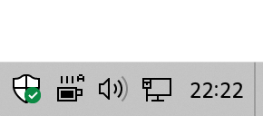

 CaffeineTray
============

CaffeineTray is a program to prevent your computer from going into sleep mode.

Installation
------------

Download latest release from https://github.com/VacuityBox/CaffeineTray/releases

Features
--------

* Preventing computer from going into sleep
* Option to keep display on
* Auto mode (automatically enable caffeine when process is running)
* User friendly interface
* Portable mode

Building from source
---------------------

Before build you need to meet these requirements:
1. Visual Studio 2019 (with MSVC)

To build the project:
1. Open CaffeineTray.sln
2. Run build

License
-------

This program is licensed under GNU General Public License v3.0 or later:

Copyright (c) 2020-2021 VacuityBox

    This program is free software: you can redistribute it and/or modify
    it under the terms of the GNU General Public License as published by
    the Free Software Foundation, either version 3 of the License, or
    (at your option) any later version.

    This program is distributed in the hope that it will be useful,
    but WITHOUT ANY WARRANTY; without even the implied warranty of
    MERCHANTABILITY or FITNESS FOR A PARTICULAR PURPOSE.  See the
    GNU General Public License for more details.

    You should have received a copy of the GNU General Public License
    along with this program.  If not, see <https://www.gnu.org/licenses/>.

--------------------------------------------------------------------------------

This program contains JSON library which is licensed under the [MIT License](http://opensource.org/licenses/MIT).

JSON for Modern C++ https://github.com/nlohmann/json  
Copyright (c) 2013-2021 Niels Lohmann http://nlohmann.me

