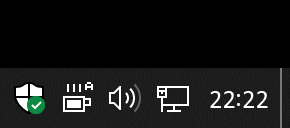

 CaffeineTake
============

CaffeineTake is a program to prevent your computer from going into sleep mode.

Installation
------------

Download latest release from https://github.com/serverfailure71/CaffeineTake/releases

Features
--------

* Preventing computer from going into sleep
* Option to keep display on
* Auto mode (automatically enable caffeine when process is running)
* User friendly interface
* Portable mode

Building from source
--------------------

Before build you need to meet these requirements:
1. Visual Studio 2022 (with MSVC)

To build the project:
1. Open CaffeineTake.sln
2. Run build

--------------------------------------------------------------------------------

Credits
-------

JSON for Modern C++ https://github.com/nlohmann/json  
Copyright (c) 2013-2021 Niels Lohmann http://nlohmann.me  
License: [MIT](http://opensource.org/licenses/MIT)

--------------------------------------------------------------------------------

License
-------

This program is licensed under GNU General Public License v3.0 or later.
